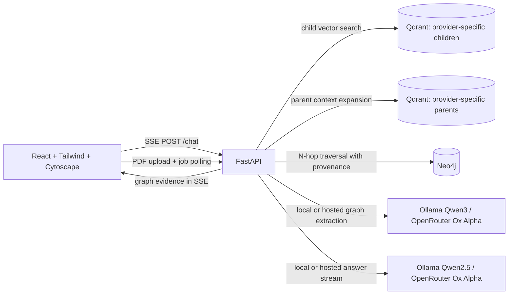

# GraphRAG Assessment

An end-to-end, local-first GraphRAG application: documents are ingested with
parent-child hierarchical chunking, typed entity relationships are extracted into
Neo4j with chunk-level provenance, and a FastAPI backend streams grounded,
citation-bearing answers to a React chat UI with a live graph inspector.

The default local deployment runs Qdrant and Neo4j in containers and Ollama on
the host. A top-level UI switch selects either local Ollama models or OpenRouter
for embeddings, graph extraction, and answer generation. Qdrant and Neo4j can
also be configured to use hosted services through environment variables.

## Architecture



Ingestion path: `chunk → embed → upsert child + parent vectors → extract typed
relationships per child chunk → MERGE into Neo4j with source, parent, and child
chunk IDs`.

Query path: `condense follow-up → embed → child vector search + Neo4j traversal
(concurrently) → expand hits to parent contexts → verify provenance → stream
answer with [S<n>] and [G<n>] citations`.

### Repository layout

| Path | Contents |
| --- | --- |
| `backend/` | FastAPI service (`app/`), Dockerfile, packaging |
| `frontend/` | React 19 + Vite + Tailwind 4 UI, nginx image |
| `tests/backend/` | pytest suites (no external services required) |
| `tests/frontend/` | Vitest suites for the API layer and chat UI |
| `docker-compose.yml` | Qdrant, Neo4j, API, UI in one command |

## Quick start

```bash
# 1. Pull the local models (host Ollama must already be running).
ollama pull qwen3-embedding
ollama pull qwen3:4b
ollama pull qwen2.5:7b-instruct

# 2. Optional: enable the OpenRouter mode in the UI.
export OPENROUTER_API_KEY='your-key-here'

# 3. Start Qdrant, Neo4j, the API, and the UI.
docker compose up --build
```

Open `http://127.0.0.1:5173` (API docs: `http://127.0.0.1:8090/docs`). The UI is served by nginx, which proxies `/api/*`
to the API with buffering disabled so SSE tokens arrive as they are generated.
`host.docker.internal` reaches host Ollama on macOS and, via the `extra_hosts`
mapping, on modern Linux Docker.

To run the models in a container instead, start the optional profile with
`docker compose --profile ollama up --build`, set
`OLLAMA_URL=http://ollama:11434`, and pull the models inside that container.
Host Ollama remains the better default on Apple Silicon because it can use Metal.

### Running without Docker

```bash
# Backend (expects Qdrant on :6333 and Neo4j on :7687)
cd backend
python -m venv .venv && source .venv/bin/activate
pip install -e '.[dev]'
uvicorn app.main:app --reload --port 8080   # http://127.0.0.1:8080/docs

# Frontend
cd frontend
pnpm install
pnpm dev                                     # http://127.0.0.1:5173
```

The UI defaults to `http://127.0.0.1:8080/api/v1`; override with `VITE_API_BASE`
if the API runs elsewhere. Copy `backend/.env.example` to `backend/.env` only to
change the defaults.

## API surface

| Endpoint | Purpose |
| --- | --- |
| `GET /api/v1/health/live` | Process liveness probe |
| `GET /api/v1/health/ready` | API readiness probe |
| `GET /api/v1/health/model-providers` | Available LLM-provider capabilities; never returns secrets |
| `POST /api/v1/ingest` | Async ingestion of inline documents; returns a `job_id` |
| `POST /api/v1/ingest/file` | Async ingestion of a text-selectable PDF |
| `GET /api/v1/ingest/{job_id}` | Job status: `queued`, `chunking`, `embedding`, `graph`, `completed`, `failed` |
| `POST /api/v1/ingest/{job_id}/cancel` | Cancel a queued or running ingestion job |
| `GET /api/v1/knowledge-base/documents` | List indexed documents and their vector counts |
| `GET /api/v1/knowledge-base/usage` | Count vector and graph records |
| `DELETE /api/v1/documents/{source_id}` | Remove one document's vectors and graph support |
| `DELETE /api/v1/knowledge-base` | Clear all application vectors and graph facts |
| `POST /api/v1/retrieve` | Fused child citations, parent contexts, and graph triples |
| `GET /api/v1/graph/subgraph` | Node/edge JSON for the graph visualizer |
| `POST /api/v1/chat` | SSE stream: `sources`, `parents`, `graph`, `token`, `error`, `done` |
| `POST /api/v1/evaluate` | Deterministic retrieval and provenance scoring |

### Sample requests

```bash
# Ingest text
curl -X POST http://127.0.0.1:8090/api/v1/ingest \
  -H 'content-type: application/json' \
  --data '{"documents":[{"source_id":"architecture-notes","content":"Your document text."}]}'

# Ingest a PDF and follow progress
curl -X POST -F file=@acquisition.pdf http://127.0.0.1:8090/api/v1/ingest/file
curl http://127.0.0.1:8090/api/v1/ingest/<job_id>

# Stream a grounded answer, including a follow-up turn
curl -N -X POST http://127.0.0.1:8090/api/v1/chat \
  -H 'content-type: application/json' \
  --data '{
    "query": "What did it pay?",
    "history": [
      {"role": "user", "content": "Who acquired Activision Blizzard?"},
      {"role": "assistant", "content": "Microsoft did [S1]."}
    ]
  }'

# Visualization subgraph
curl 'http://127.0.0.1:8090/api/v1/graph/subgraph?query=Microsoft&graph_hops=2'
```

Suggested questions once a document is indexed:

- "Who acquired Activision Blizzard?"
- "Which evidence supports the relationship between Microsoft and Game Pass?"
- "Who are the Artemis II crew members?" followed by "When do they launch?"

## How the pieces work

### Hierarchical indexing

Documents are split on blank lines first, then packed into parent blocks of
~1,000 tokens and child blocks of ~200 tokens, so a chunk rarely begins or ends
mid-sentence. Budgets are expressed in tokens and converted with a words-to-tokens
ratio, because whitespace-word counting understates subword LLM tokens by roughly
30%. Children are always literal substrings of their parent, which is what makes
the provenance check below meaningful. Chunk IDs are UUIDv5 over the normalized
text, so re-ingesting a document updates rather than duplicates it.

Children carry the query vectors; parents are stored in a separate Qdrant
collection and are what the LLM actually reads.

### Graph modeling

Relationships are extracted per child chunk with the currently selected provider:
local Ollama uses `qwen3:4b`; OpenRouter uses `stealth/ox-alpha` with structured
JSON output at temperature 0. Ox Alpha uses JSON-object mode because its
providers do not currently route strict JSON Schema requests; the backend
validates the object locally before evidence grounding. Every relationship must quote
evidence that appears verbatim in the chunk, or it is discarded before it ever
reaches Neo4j. Entities become `:Entity` nodes with an additional PascalCase
label for their type (`:Entity:Company`), uniquely keyed on
`(namespace, canonical_name)`; relationships carry `source_id`,
`parent_chunk_id`, `child_chunk_id`, and the evidence quote.

Traversal seeds are chosen from quoted phrases and capitalized spans in the
query before falling back to keywords, with question words filtered out.

### Chat, streaming, and verification

`POST /api/v1/chat` runs a LangGraph workflow —
`plan_multi_hop → retrieve_evidence → verify_provenance` — then streams the
answer. Evidence events are emitted before the first token, so the UI can render
citations while the answer is still being generated. The verification node drops
any citation whose excerpt is not contained in its parent context, keeping the
rest of the evidence rather than discarding the whole set.

Conversations are stateless on the server: the client sends recent turns as
`history`, which are replayed to the model for reference resolution and are also
used to expand a bare follow-up ("what did it pay?") into a retrievable query.

### Local / OpenRouter mode

The top-right **LLM** switch is sent with every chat and ingestion request. In
**Local** mode, Ollama creates embeddings (`qwen3-embedding`), extracts graph
facts (`qwen3:4b`), and generates answers (`qwen2.5:7b-instruct`). In
**OpenRouter** mode, OpenRouter creates embeddings
(`nvidia/nemotron-3-embed-1b:free`) and uses the configured chat/graph model
(`stealth/ox-alpha` by default) for generation and graph extraction. Because
the two embedding models can use different vector dimensions, their documents
are stored in separate Qdrant collections and are retrieved only with the
matching provider. Neo4j stores the shared symbolic graph with document-level
provenance. The UI disables OpenRouter unless `OPENROUTER_API_KEY` is configured.

### Evaluation

`POST /api/v1/evaluate` scores a versionable set of known questions on source
recall, graph-triple recall, and citation-grounding rate — deterministically, with
no LLM judge — which makes it usable as a regression gate after a chunking,
embedding, or prompt change.

```bash
curl -X POST http://127.0.0.1:8090/api/v1/evaluate \
  -H 'content-type: application/json' \
  --data '{
    "cases": [{
      "id": "activision-acquisition",
      "query": "Who acquired Activision Blizzard?",
      "expected_source_ids": ["phil-spencer-email-to-microsoft-employees"],
      "expected_graph_triples": [["Microsoft", "ACQUIRED", "Activision Blizzard"]]
    }]
  }'
```

## Design trade-offs: accuracy versus latency

- **Small children, big parents.** Child chunks maximize vector precision;
  expanding to parents costs prompt tokens and time to first token but is what
  keeps generated answers grounded rather than fragmentary.
- **Graph extraction is the expensive step.** It runs one structured-output call
  per child chunk. Calls are issued with bounded concurrency (default 4, via
  `GRAPH_EXTRACTION_CONCURRENCY`) over a pooled HTTP client, which is far faster
  than serial extraction while keeping a laptop-sized Ollama responsive. Raising
  it trades ingestion latency for GPU contention with the chat model.
- **Verbatim-evidence filtering trades recall for trust.** Some true
  relationships are dropped when the model paraphrases its evidence quote. That
  is deliberate: an unsupported edge in the graph is more expensive than a
  missing one.
- **Traversal is capped at three hops** and a bounded fact count. Deeper
  traversal finds more connections but grows the Cypher result set superlinearly
  on a dense graph.
- **Retrieval failures degrade, they do not blank the answer.** Only the
  unverifiable citations are removed.
- **Ingestion jobs are in-memory.** That keeps the single-node deployment simple
  and the API responsive; a durable queue is required before running multiple API
  workers.
- **Local inference keeps documents private** at the cost of host latency. In
  OpenRouter mode, the chunk text sent for embedding, graph extraction, and
  answer generation leaves the local machine. The container Ollama profile
  exists for Linux GPU hosts.

## Verify

```bash
# Backend: lint and tests (no external services needed)
ruff check backend/app tests/backend
pytest

# Frontend: lint, types, unit tests, production build
cd frontend
pnpm lint && pnpm typecheck && pnpm test && pnpm build
```

CI runs all of the above plus `docker compose config` on every push and pull
request.

## Known limitations

- Scanned PDFs are rejected rather than silently indexed as empty; OCR is not
  wired up.
- Entity resolution is name-based, so "MSFT" and "Microsoft" remain distinct
  nodes.
- The LangGraph planner bounds traversal deterministically; it does not yet
  re-query after an unresolved hop.
