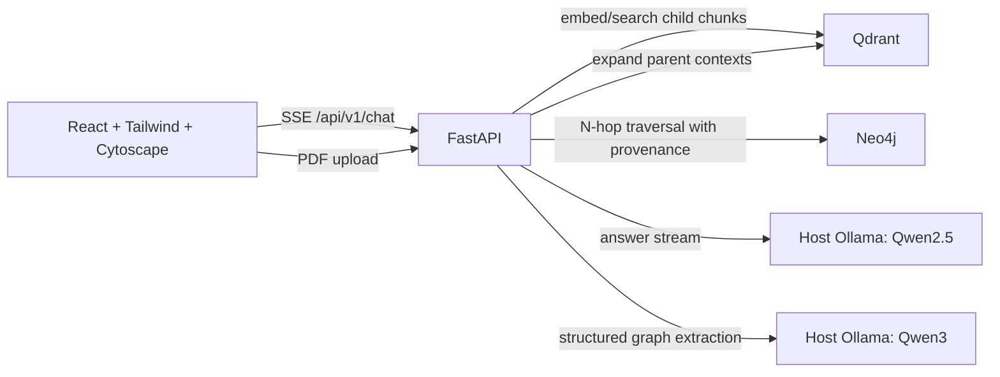

# GraphRAG Assessment

An end-to-end GraphRAG take-home implementation. This repository is intentionally
independent of previous prototypes and will be built in clearly verifiable stages.

## Stage 1 — FastAPI foundation

The backend currently provides:

- a versioned FastAPI application;
- liveness and readiness health checks;
- typed Pydantic API contracts for future ingestion, chat, citations, and graph responses;
- automatic OpenAPI documentation at `/docs`.

Stage 2 adds hierarchical ingestion. It stores small, searchable child chunks
(default: 200 whitespace tokens) in Qdrant with their `parent_id`; the parent
context blocks (default: 1,000 tokens) live in a separate Qdrant collection.
Both record source, position, normalized-text hash, and stable UUID provenance.

Stage 3 adds source-grounded typed relationships in Neo4j. Each relationship
records `source_id`, `parent_chunk_id`, `child_chunk_id`, exact evidence, and a
namespace separating this assessment graph from other local projects.

Stage 4 fuses vector and graph evidence: a query embeds into Qdrant, retrieves
small child chunks, expands them to their parent contexts, and traverses
query-matched Neo4j entities for up to three hops. The resulting citations,
parent contexts, and graph triples are returned by `POST /api/v1/retrieve`;
`GET /api/v1/graph/subgraph` returns visualization-ready node/edge JSON.

The API also accepts a text-selectable PDF at `POST /api/v1/ingest/file`.
Scanned PDFs are rejected instead of silently storing empty content; OCR can be
added later if needed.

## Stage 5–6 — Grounded chat and evidence UI

`POST /api/v1/chat` performs the Stage 4 retrieval first and returns SSE events
for citations, parent contexts, graph facts, generated tokens, errors, and
completion. The React/Tailwind UI streams those events in real time and renders
both expandable source evidence and a pan/zoom Cytoscape graph.

The generation model is `qwen2.5:7b-instruct`; Qwen3 is retained only for
structured graph extraction, so answer streams do not expose reasoning text.

## Stage 7 — Evaluation and provenance quality gates

`POST /api/v1/evaluate` accepts a small, versionable set of known questions and
their expected source IDs and graph triples. It reports:

- source recall — expected sources present in child retrieval;
- graph recall — expected `(subject, predicate, object)` facts returned;
- citation-grounding rate — every displayed child excerpt occurs in its parent
  context;
- pass rate — all applicable checks passed for a case.

This evaluates the retrieval/provenance layer deterministically, without using
an LLM as a judge. It is designed for regression testing after a chunking,
embedding, or graph-extraction change.

Example using the Phil Spencer acquisition document already ingested locally:

```bash
curl -X POST http://127.0.0.1:8081/api/v1/evaluate \
  -H 'content-type: application/json' \
  --data '{
    "cases": [{
      "id": "activision-acquisition",
      "query": "Who acquired Activision Blizzard?",
      "expected_source_ids": ["phil-spencer-email-to-microsoft-employees"],
      "expected_graph_triples": [["Microsoft", "ACQUIRED", "Activision Blizzard"]]
    }]
  }'
```

## Stage 8 — Reproducible delivery

The repository now includes Dockerfiles for the API and frontend plus
`docker-compose.yml` for Qdrant, Neo4j, API, and the static UI. Ollama remains
on the host machine; this preserves the air-gapped local model and avoids
copying model weights into an image.

```bash
# Ensure Ollama is running and models are already pulled on the host.
ollama pull qwen3-embedding
ollama pull qwen3:4b
ollama pull qwen2.5:7b-instruct

docker compose up --build
```

Then open `http://127.0.0.1:5173`. The frontend proxies `/api/*` to the API,
including unbuffered SSE chat events. On macOS, `host.docker.internal` reaches
the host Ollama service. The included `extra_hosts` mapping provides the same
name on modern Linux Docker.

## Production workflow additions

### Background ingestion with progress

`POST /api/v1/ingest` and `POST /api/v1/ingest/file` now return immediately
with a `job_id`. Poll `GET /api/v1/ingest/{job_id}` for `queued`, `chunking`,
`embedding`, `graph`, `completed`, or `failed` status plus graph-child progress.
The React UI polls this endpoint automatically. The in-memory job registry is
deliberate for this single-node assessment; replace it with a durable queue for
multi-worker production deployments.

### LangGraph evidence workflow

Chat requests are orchestrated through a LangGraph workflow:

`plan_multi_hop → retrieve_evidence → verify_provenance`

The planning node bounds graph traversal, retrieval fuses Qdrant child hits
with parent contexts and Neo4j N-hop facts, and verification checks that each
child citation is contained in its returned parent context. This provides an
inspectable agentic foundation without allowing an unconstrained model to
choose arbitrary tools.

### Suggested test queries

- “Who acquired Activision Blizzard?”
- “Which evidence supports the relationship between Microsoft and Game Pass?”
- “Who are the Artemis II crew members?”
- “What does the retrieved context say about the Artemis II launch date?”

### Accuracy versus latency trade-offs

- Smaller child chunks improve retrieval precision, but expanding to parent
  chunks preserves the surrounding context required for grounded generation.
- Graph extraction is intentionally sequential and evidence-constrained. It is
  slower for long PDFs, but avoids flooding Neo4j with unsupported facts. Use a
  queue with controlled worker concurrency for large-scale ingestion.
- The workflow limits traversal to three hops and caps returned facts to bound
  query cost. Increase only for questions that genuinely require deeper paths.
- Local Ollama keeps documents private but shifts inference latency to the host
  machine. The optional Compose Ollama profile is appropriate for Linux; host
  Ollama is recommended on Apple Silicon for Metal acceleration.

### Architecture



## Run locally

```bash
cd backend
python -m venv .venv
source .venv/bin/activate
pip install -e '.[dev]'
uvicorn app.main:app --reload --port 8080
```

Open `http://127.0.0.1:8080/docs`.

### Frontend

```bash
cd frontend
pnpm install
pnpm dev
```

Open `http://127.0.0.1:5173` while the API is running on port 8080 (or set
`VITE_API_BASE=http://127.0.0.1:8081/api/v1` when using port 8081).

For Stage 2, run Qdrant locally on `http://localhost:6333` and ensure Ollama
has `qwen3-embedding:latest` available. Copy `.env.example` to `.env` only if
you need to override those defaults.

### Stage 2 ingestion example

```bash
curl -X POST http://127.0.0.1:8080/api/v1/ingest \
  -H 'content-type: application/json' \
  --data '{"documents":[{"source_id":"architecture-notes","content":"Your document text goes here."}]}'
```

## Verify

```bash
cd backend
pytest
```

## Planned API surface

| Endpoint | Stage | Purpose |
| --- | --- | --- |
| `GET /api/v1/health/live` | 1 | Process liveness probe |
| `GET /api/v1/health/ready` | 1 | Dependency readiness probe |
| `POST /api/v1/ingest` | 2–3 | Parent-child ingestion and graph extraction |
| `POST /api/v1/ingest/file` | 3 | PDF text extraction and GraphRAG ingestion |
| `POST /api/v1/retrieve` | 4 | Fused vector, parent-context, and graph evidence |
| `GET /api/v1/graph/subgraph` | 4 | Visualization-ready query subgraph |
| `POST /api/v1/chat` | 5 | SSE-streamed, cited GraphRAG answer |
| `POST /api/v1/evaluate` | 7 | Source, graph, and citation-provenance evaluation |
